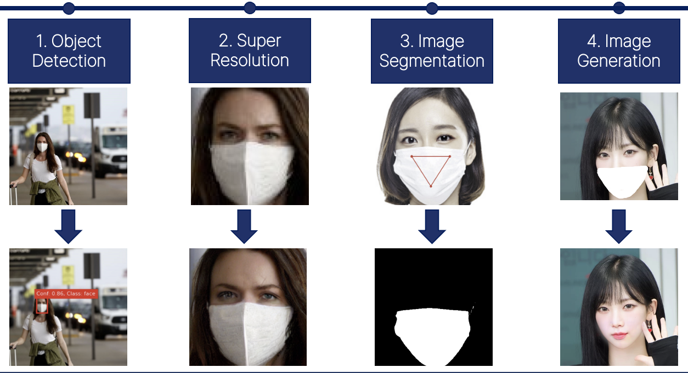
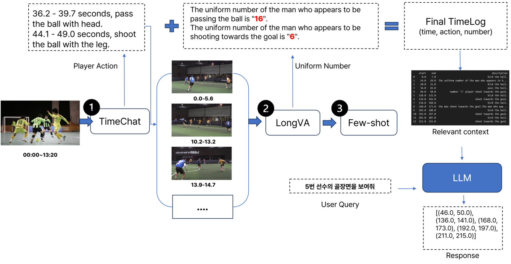
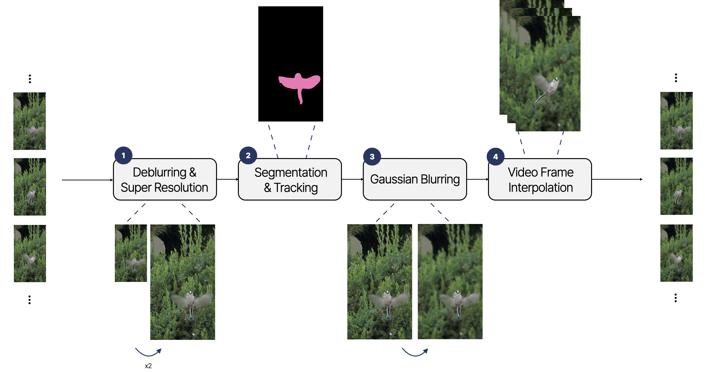
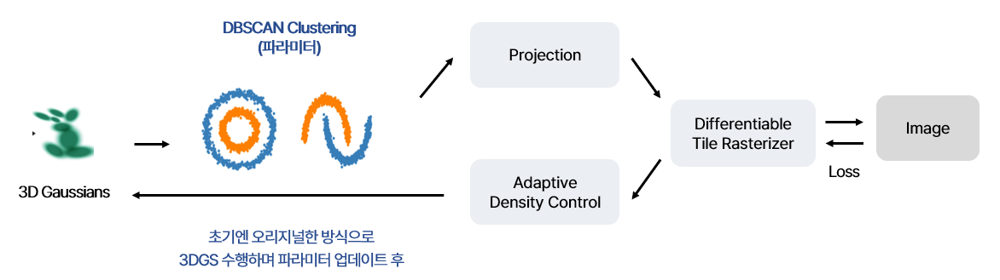

# 🖐️ Welcome to the deep daiv. Computer Vision / XAI Team!
This is repository for the [deep daiv.](https://deepdaiv.oopy.io/) Computer Vision team's code and projects.  

Project Lead : [Jaeung Lee](https://github.com/gnueaj) (2024.01 ~ present)

## '23 Winter Computer Vision

<h3> 잃어버린 얼굴을 찾아서 </h3>

[Jaeung Lee](https://github.com/gnueaj)1
, [Yuri Hong](https://github.com/glasshong)2
, [Jinhee Yoo](https://github.com/Geniefree) 2
, [Jeongyoun Kwon](https://github.com/kyuleeee) 3
, and [Jaeryung Hong](https://github.com/Jar199) 4&dagger;*
 
1Sungkyunkwan University&emsp;
2Korea University&emsp;
3Chung-Ang University&emsp;
4Ewha Womans University 
 
&nbsp;
 
 
Diffusion및 DreamBooth Fine-tuning을 활용한 마스크로 가려진 얼굴 생성  
 

## '24 Spring Vision Application  

<h3> FIFA: Futsal Identification Focused Analyzer </h3>

[Chunghyun Shin](https://github.com/chung-codes)1
, [Myeonggu Jo](https://github.com/MyeongGuJo)2
, [Sooyong Kim](https://github.com/ksyint) 3
, and [Jaeung Lee](https://github.com/gnueaj) 4&dagger;
 
1Yonsei University&emsp;
2Hanyang University&emsp;
3Seoul National University&emsp;
4Sungkyunkwan University 
 
&nbsp;
 
 
플레이어 트래킹 및 멀티모달 임베딩을 이용한 풋살 경기 영상 분석기  
 

---

<h3> 새 추적 60분 </h3>

[Yejin Kim](https://github.com/Jin1025)1
, [Sumin Cho](https://github.com/rillbrill)2
, [Wooryeon Lee](https://github.com/dnflslwlq)3
, and [Jaeung Lee](https://github.com/gnueaj) 4&dagger;
 
1Konkuk University&emsp;
2Hongik University&emsp;
3Hanyang University&emsp;
4Sungkyunkwan University 
 
&nbsp;
 
 
포커싱 전환 및 비디오 프레임 보간을 통한 시네마틱 슬로우모션 제작  

## '24 Spring Deep Learning Architecture

<h3> 3DGS 다이어트 </h3>

[Yeonkyung Lee](https://github.com/dusruddl2)1
, [Eunseo Seo](https://github.com/tjdmstj)2
, [Dayeon Woo](https://github.com/yeonyeonn)3
, [Chehun Han](https://github.com/chechae)4
, and [Changgyun Jin](https://github.com/jcg6074)5&dagger;
 
1Sejong University&emsp;
2Chungang University&emsp;
3Sungkyunkwan University&emsp; 
4Ewha Womans University&emsp;
5Seoul National University of Science & Technology&emsp; 
 
&nbsp;
 
 
3DGS 모델의 한계점인 메모리 사용량 문제를 해결하기 위한 모델 구현  

## '24 Summer Vision Application
- TBU
  
## '24 Fall eXplainable AI
- TBU
